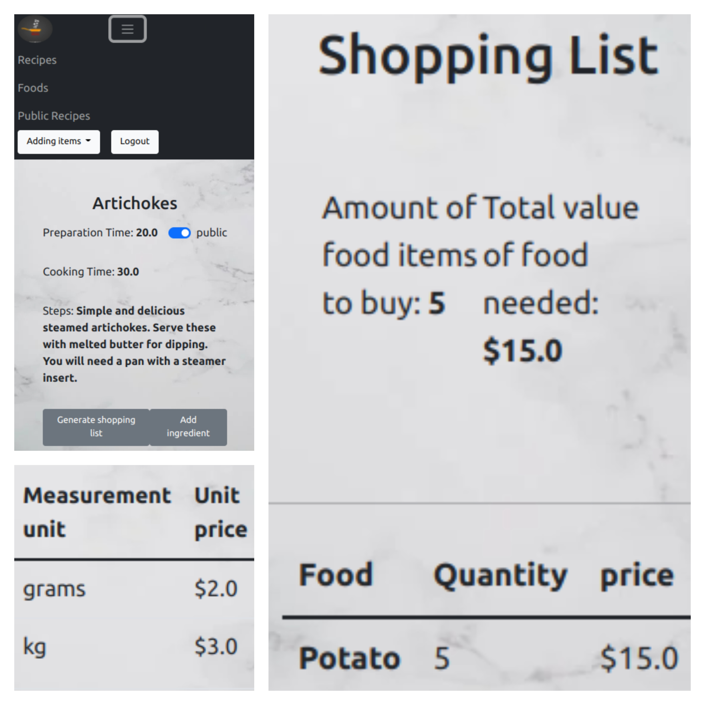

# Recipe App - Rails

## Live preview
  ## Netlify [link]()

##  Video

#### Quick review of project and  code.
#### [video link](https://drive.google.com/file/d/16cPBUSR1QRhIY9MgrYBN_jzgyt7Q427W/view?usp=sharing)

## Screenshots

## Contents
* [Home/Public Recipes](#home)
* [Recipes](#missions)
* [Food](#food)
* [Shoping List](#shoping-list)
* [Add Items](#add-items)

## General info
 A simple application developed in Ruby on Rails to create recipes. It allow you to create and save food, track of food you have and, create recipes and  shopping list based on ingredients we have to buy. 

 ## Technologies
Project is created with:
* Ruby
* Ruby on Rails
* PostgresSQL
* CSS

## Setup
To run this project, install it locally using:
- cd Desktop
- git clone https://github.com/VuDej/recipe-app-rails.git
- cd recipe-app
- bundle install
- rails db:create
- rails db:migrate

## Available Scripts

In the project directory, you can run:

### `rails s`

Runs the app in the development mode.\
Open [http://localhost:3000](http://localhost:3000) to view it in your browser.

The page will reload when you make changes.\
You may also see any lint errors in the console.

## Author 1

👤 **Dejan Vujovic**

- Github : [@VuDej](https://github.com/VuDej)
- Twitter: [@DejanVuj](https://twitter.com/DejanVuj)
- LinkedIn : [@Dejan-Vujovic](https://www.linkedin.com/in/dejan-vujovic-5a0672225/)

## Author 2

👤 **Houfaf Abdessalem**

- GitHub: [@Houfaf Abdessalem](https://github.com/abdessalem1998)
- Twitter: [@Houfaf Abdessalem](https://twitter.com/HAbdssalem)
- LinkedIn: [@Houfaf Abdessalem](https://www.linkedin.com/in/houfafabdessalem/)

## 🤝 Contributing

Contributions, issues, and feature requests are welcome!

Feel free to check the [issues page](https://github.com/VuDej/recipe-app-rails/issues/1).

## Show your support

Give a ⭐️ if you like this project!

## Acknowledgments

- A special thanks to Microverse.

## 📝 License

This project is [MIT](LICENSE) licensed.

## Contact
Created by [@VuDej](https://github.com/VuDej) and [@Houfaf Abdessalem](https://github.com/abdessalem1998)
